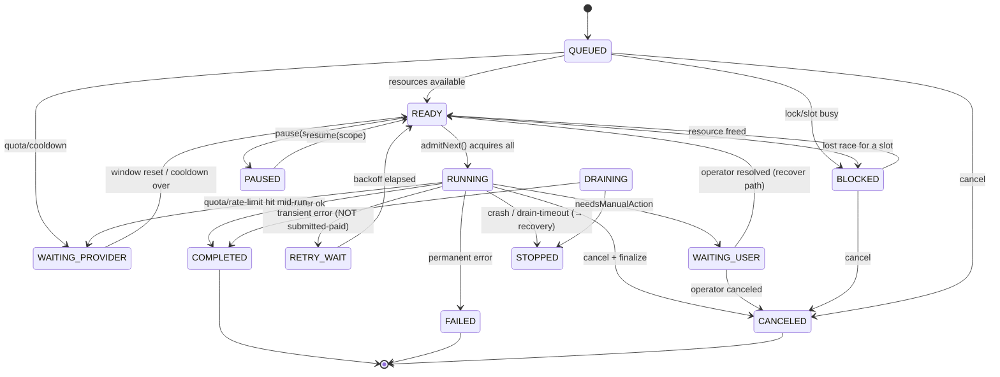

# P0 Step 5.7 — Worker Scheduler (architecture & design)

**Status:** design only (scheduling). This document does **not** change any runtime,
protocol, recovery, pairing, or provider code. It specifies the Worker Scheduler that a
later step will implement, so that Step 5C (production Control Plane) can be designed
against a known worker-side scheduling contract.

> **Prerequisite shipped — Step 5.7a.** The *recovery-safety* foundation this scheduler
> depends on (the `SUBMITTING` crash-window barrier, generation-attempt identity, the
> golden rule as an enforced invariant, the extended recovery classifier + resume
> contract, provider recovery capabilities, and drain-vs-stop) is now **implemented and
> tested** — see **[recovery-contract.md](recovery-contract.md)**. The scheduler design
> below builds on that contract.

Everything here is consistent with the shipped P0 stack: Protocol v1
(`lib/protocol/*`), the recovery journal + classifier (`lib/worker/recovery-*.mjs`),
the crash-safe WorkerRuntime (`lib/worker/worker-runtime.mjs`), the JobHandler
interface (`lib/worker/handlers/job-handler.mjs`), capability advertisement
(`WORKER_HELLO.capabilities` / `providerDurations`), pairing/credentials
(Step 5B), and the quota-safety rule `submittedToProvider ⇒ never auto-regenerate`.

---

## 0. Review corrections (v2 — AUTHORITATIVE; supersedes any conflicting text below)

An independent 5-dimension architecture review found 13 must-fix issues (mostly the
design contradicting the *shipped* state machine / handler / recovery layer). Where
this section conflicts with §§3–26, **this section wins**; the later sections are kept
for narrative but must be read through these corrections. Full findings + resolutions:
[worker-scheduler-review.md](worker-scheduler-review.md).

**C1 — No `RUNNING → retry` re-entry; a `jobId` executes at most once.**
`RETRY_WAIT` and `WAITING_PROVIDER` are **pre-RUNNING admission states only**
(reachable from `QUEUED`/`BLOCKED`, never from `RUNNING`). The shipped
`job-states.mjs` makes `RUNNING`'s only exits `{NEEDS_MANUAL_ACTION, SUCCEEDED,
FAILED, CANCEL_REQUESTED, INTERRUPTED}` — `RUNNING → ACCEPTED` is illegal, and the
Runtime executes a `jobId` at most once. Therefore a failure *after* execution began
goes **terminal `FAILED`** on the wire; a "retry" is a **new `jobId` + new
`generationAttemptId` minted by the Control Plane**, not a local re-admission of the
same `jobId`. (Corrects §5.1/§5.2/§5.3/§13.)

**C2 — Post-submission "download/import retry" is a RECOVERY operation, not a
re-`execute()`; it needs a new resume contract.** The shipped `handler.execute(input,
ctx)` always runs from the top and re-calls the orchestrator (re-submitting = double
charge), and `handler.recover(record)` returns only a descriptor and is never invoked
by the Runtime. So the "download-only / import-only" auto-retries in §13 are **not
implementable on the shipped contract**. They require a **new resume contract**
(dependency this step declares, implemented later): the Runtime invokes
`handler.recover(record)` — or a distinct `resume(record, ctx)` — with
`submittedToProvider`/`providerSubmissionId`/`localResultRef` in a *resume context*,
so the handler continues from download/import **without re-generating**. Until that
contract exists, no submitted job may be re-run. (Corrects §13/§5.4/§3.)

**C3 — Close the submit/persist crash window (fail-safe, not fail-open).** There is a
window between the provider accepting a generation and the journal persisting
`submittedToProvider=true`; a crash there currently leaves `submittedToProvider=false`
→ `classifyRecovery → NOT_SUBMITTED_SAFE_TO_RETRY` → an automatic **second paid
generation**. Required recovery-layer additions: (a) a **`SUBMITTING`/uncertain**
journal state written *before* the provider call; (b) `classifyRecovery` routes
`SUBMITTING` to a **non-generating "verify-with-provider"** path (never
safe-to-retry); (c) a **provider idempotency key** in the CapabilityContract so a
re-attempt after an uncertain crash cannot double-charge. (Extends
`recovery-journal` + `recovery-classifier`; corrects §11/§16.)

**C4 — Dedupe by `generationAttemptId`, not just `jobId`.** The golden rule is stated
per `generationAttemptId`, but every shipped mechanism keys on `jobId`. The
Scheduler/Runtime must keep a **durable, journal-derived seen-`generationAttemptId`
index** and reject/settle any second offer whose `generationAttemptId` already has a
submitted/in-flight record — otherwise two `jobId`s carrying one attempt both submit.
(Corrects §16 / Appendix A #3.)

**C5 — Persist quota state; debit on submit-confirm, not admission.** The `QuotaLedger`
(per-account hourly/daily counters + `cooldownUntil`) is **not** reconstructable from
the journal as written (`sweep()` deletes `submittedAt` evidence). Required:
(a) persist per-account/window counters + `cooldownUntil` in the drain snapshot **and**
keep `providerAccountId`+`submittedAt` in the journal as the crash fallback;
(b) forbid `sweep()` from removing any record whose `submittedAt` is still inside the
largest quota window; (c) **debit quota on the `ctx.markSubmittedToProvider` signal**
(the same event that sets `submittedToProvider=true`), via a **Runtime→Scheduler
callback** — not "at admission". Credit-back applies only to a confirmed
*pre-submission* failure. (Corrects §11/§15/§16/§22.1.)

**C6 — Multi-key admission needs reservation (not just all-or-nothing).** All-or-nothing
acquisition is deadlock-free but **not livelock/starvation-free** for a job needing ≥2
independently-contended keys (aging cannot make two keys free *simultaneously*). Add
**resource reservation**: when the highest-effective-priority multi-key waiter has some
of its keys free, *hold* those keys for it (don't grant to a fresh single-key job) until
its whole set is satisfiable. (Corrects §7/§9/§12/D4/D5/Appendix #9.)

**C7 — A lock is held while the resource is OCCUPIED, not only while `RUNNING`.** A
`WAITING_USER` (`NEEDS_MANUAL_ACTION`) Grok job still occupies its exclusive browser
profile. Define lock-hold by **"external window/session occupied"** — `RUNNING` **and**
`WAITING_USER` (and any state with an open provider session) keep their exclusive
profile/account locks; otherwise the Scheduler could admit a second job onto the
occupied profile. (Corrects §9/§5.1.)

**C8 — Pause is fail-SAFE for paid jobs.** Pause must survive restart durably (its own
persisted flag, not only the drain snapshot). If pause state cannot be confirmed after a
restart, **block admission of `consumesQuota` actions** until an operator re-confirms —
pause fails *safe* for paid work (unlike admission backpressure, which may fail-open for
free work). (Corrects §14/§17/§25.)

**C9 — Job expiry while parked.** The Scheduler is exactly what holds accepted jobs a
long time (Provider-wait/Retry/Blocked/Delayed), yet `expiresAt` (validated + persisted
by shipped code) was unaddressed, and `job-states.mjs` has **no `ACCEPTED → EXPIRED`**
edge (EXPIRED is cloud-initiated from `QUEUED`/`DISPATCHED`). Resolution: add `expiresAt`
to the §2 descriptor; on expiry while parked the Worker finalizes via **`FAILED`** with a
distinct `E_JOB_EXPIRED` reason (the only ACCEPTED-reachable terminal besides CANCELED),
**or** proactively surfaces near-expiry to the Control Plane which owns `EXPIRED`. Never
silently drop an expired parked job. (Corrects §5/§6/§2.)

**C10 — CapabilityContract + job descriptor fields are NEW artifacts this step
introduces.** Most fields (§2 descriptor: `userId`, media-write flag, `expiresAt`,
`resourceKeys`; §10 contract: `estimatedRuntimeMs`, `costPerGeneration`, `cooldownMs`,
`maxConcurrentJobs`, `concurrencyScope`, per-account quotas, idempotency key) **do not
exist** in the shipped `job-contracts.mjs`/`WORKER_HELLO` today. They are declared here
as the contract the implementation must **add** (worker config + capability
advertisement extension) — the doc must not imply they already exist. (Corrects
§2/§10/§8.)

**C11 — Boundary rule: pure protocol *values* yes, wire/transport no.** §4 and §20 are
reconciled: the Scheduler MAY import **pure protocol modules that expose values/helpers**
(`job-states`, `recovery-classifier`, error codes) — exactly as the recovery layer does —
but MUST NOT import or construct **envelopes/transport/`ws`/`child_process`/fs (except an
injected journal reader)/credentials/provider adapters**. "No protocol" in §20 means "no
*wire* protocol / envelope construction", not "no protocol enums". (Corrects §4/§20.)

**C12 — Drain requires a NEW Runtime path, distinct from `stop()`.** The shipped
`WorkerRuntime.stop()` aborts + CANCELs every active job (including RUNNING paid work) —
the exact wasted-quota outcome §14/§15/D7 forbid. Graceful drain is therefore a **new
Runtime capability** (seal admission → let RUNNING paid jobs finish to the deadline →
mark leftovers `STOPPED`/`INTERRUPTED` via recovery, never `_finalizeCanceled`). The doc's
"does not change any runtime" applies to *this design task*; the drain feature is an
explicitly-flagged future Runtime change. (Corrects §3/§15.)

**C13 — Identity for keys/priority must be journaled.** The admission-relevant identity
a job's `resourceKeys`/locks/quota/`capabilityRef`/`priority` derive from
(`providerAccountId`, `profileRef`, `projectId`, `userId`, priority) is **not** all in
the shipped journal today. The recovery-journal record must be extended with these
(secret-free) fields so the Scheduler can rebuild admission state after a crash without
the (advisory, possibly-lost) snapshot. **Precedence rule:** on recovery the **journal is
authoritative for safety** (`submittedToProvider`, terminal state, quota evidence); the
snapshot is advisory for *ordering/backoff/pause-UX* only and is never allowed to
override a safety fact. (Corrects §15/§16/§5.4.)

**C14 — Multi-account selection is pre-submission assignment, never fallback.** A
future Worker Scheduler MAY select one eligible account from the explicitly enrolled,
enabled, healthy account pool for an unassigned attempt. That initial selection is
provider-neutral and quota/cooldown-aware. It atomically binds the opaque
`providerAccountId`, profile resource key, and tunnel resource key to the attempt before
provider submission and freezes that affinity no later than `markSubmitting()`. After
that barrier, every observe/download/import/recovery action stays on the same account,
profile, and tunnel. The same `generationAttemptId` is never submitted through another
account, including after an uncertain response. A deliberate paid Retry is a new
`generationAttemptId` and receives a new pre-submission assignment under the existing
retry policy. (Corrects §11's earlier Control-Plane-only account-switch language.)

**C15 — Per-account tunnel leases are admission resources, not routing fallbacks.**
Every enrolled real-provider account owns one immutable profile binding and one immutable
opaque tunnel reference. The private upstream identity remains in the Worker-local encrypted
tunnel store. Admission for that account requires its exact tunnel lease to be `READY` and its
exact profile lock to be owned; both resources have capacity one. Different account/profile/
tunnel triples may be admitted concurrently up to the later Worker-wide resource limit, but a
single triple never runs two jobs at once. Tunnel failure parks or fails that account's work and
never selects direct networking or changes the frozen account affinity. B1C implements the
provider-neutral store/lease/lock boundary; scheduler selection, RAM/CPU pressure admission, and
per-account quota/cooldown orchestration remain deferred.

---

## 1. Purpose

Today the WorkerRuntime runs a job the moment a `JOB_OFFER` is accepted (one logical
job per `jobId`, no queue, no concurrency governance beyond the capability check).
That is correct but does not scale: a Worker may hold many accepted jobs across many
providers/accounts/profiles/projects, each with different concurrency limits, quota,
cost, and locking needs. **The Scheduler is the worker-local admission-control and
ordering layer** that decides *which accepted job runs, when, and in what order*,
subject to concurrency, locks, quota, priority, fairness, pause, drain, and
backpressure — while remaining **completely provider-neutral**.

The Scheduler is **not** a distributed/cloud scheduler. It governs one Worker. The
production Control Plane (Step 5C) does the coarse cross-Worker routing; the Worker
Scheduler does the fine intra-Worker admission (see §21, two-tier scheduling).

---

## 2. Responsibilities

### Inside the Scheduler (owns)
- **Queueing** of accepted jobs (multi-queue model, §6).
- **Admission control**: decide when a job is `READY` and atomically acquire the
  concurrency slots + locks + quota it needs before it runs (§8–§11).
- **Ordering**: priority + aging + fairness across providers/accounts/projects/users
  (§7, §12).
- **Retry scheduling**: compute backoff/delay from a failure classification and
  re-queue — **without ever scheduling a paid re-generation automatically** (§13, §16).
- **Pause/resume** at job/project/provider/worker/global scope (§14).
- **Drain** and graceful shutdown, with a persistable queue (§15).
- **Recovery** of its queue from the journal on restart, honoring quota-safety (§16).
- **Backpressure** decisions from resource-pressure signals (§17).
- **Metrics + observability events** (§18–§19), sanitized.

### Outside the Scheduler (must NOT own — hard boundary, §20)
- **Execution of work.** Handlers execute; the Scheduler only *admits* and *sequences*.
- **Any provider knowledge**: browser/cookies/tokens/UI/HTTP endpoints, provider names,
  CDN URLs, media/absolute paths, DB, WebSocket/transport, protocol envelope
  construction, credentials/pairing. The Scheduler consumes **declarative capability
  contracts** (§10) and **opaque resource keys** (§8) — never provider-specific code.
- **What a job *is*.** The Control Plane defines jobs; the Scheduler treats a job as an
  opaque `{ jobId, action, priority, resourceKeys, capabilityRef, quotaRef,
  submittedToProvider, attemptRefs }` descriptor.
- **The quota-spend decision.** The Scheduler tracks and enforces quota state but never
  *chooses to spend* a new paid generation; that is a Control-Plane/operator decision
  surfaced as a fresh `generationAttemptId` (§12, §16).

**One-line contract:** the Scheduler turns *"these N accepted jobs"* into *"run this
one now"* — deterministically, fairly, quota-safely, and provider-blindly — and never
touches a byte a handler or provider owns.

---

## 3. Placement & relationship diagram

```
                 Control Plane (Step 5C, cloud)
                   │  JOB_OFFER / cancel / reconcile-request   (Protocol v1, wire)
                   ▼
   ┌───────────────────────────────────────────────────────────┐
   │ Worker process                                             │
   │                                                            │
   │   WorkerRuntime  ── accepts offer, validates, owns the ────┐│
   │      │  protocol lifecycle + journal + pending-ack + ACKs  ││
   │      │  (unchanged; delegates *when to execute* to below)  ││
   │      ▼                                                     ││
   │   Scheduler  ── queue · admission · concurrency · locks ── ││
   │      │  quota · priority · fairness · retry · drain        ││
   │      │  (provider-NEUTRAL; consumes capability contracts)  ││
   │      ▼                                                     ││
   │   Handler (JobHandler: validate/execute/cancel/recover)   ││
   │      ▼                                                     ││
   │   Provider Adapter (e.g. Grok orchestrator adapter)       ││
   │      ▼                                                     ││
   │   Legacy Provider (lib/grok-video.mjs → grok-video-browser)││
   └───────────────────────────────────────────────────────────┘
```

**Boundary contracts (what crosses each arrow):**

| Boundary | Downward | Upward |
|---|---|---|
| ControlPlane→Runtime | canonical `JOB_OFFER` (Protocol v1) | lifecycle events + `MESSAGE_ACK` + reconcile |
| Runtime→Scheduler | `enqueue(jobDescriptor, runContext)` | `onAdmit(jobId)→run`, `onSchedulerEvent` |
| Scheduler→Handler | `handler.execute(input, ctx)` on admission | result / `needsManualAction` / throw |
| Handler→Adapter | provider-neutral orchestrator call | phases / result |
| Adapter→Legacy | runner/spawn (browser/python) | STATUS lines / files |

The Scheduler sits **between** the Runtime's protocol lifecycle and the Handler's
execution. When implemented, the Runtime's "run now" step becomes "enqueue"; the
Scheduler calls back to run the handler once the job is admitted. The Runtime keeps
owning journaling, `submittedToProvider`, pending-ack, terminal ACKs, and CRIT-1
crash-safe terminal delivery — **the Scheduler never emits protocol messages.**

---

## 4. Component model (class diagram)

```
┌────────────────────┐        ┌─────────────────────────┐
│ WorkerScheduler    │◇──────▶│ QueueSet                │
│  enqueue(job)      │        │  fifo/priority/delayed/  │
│  admitNext()       │        │  retry/manual/blocked/   │
│  pause(scope)      │        │  providerWait           │
│  resume(scope)     │        └─────────────────────────┘
│  drain()/stop()    │        ┌─────────────────────────┐
│  recoverFrom(jrnl) │◇──────▶│ ResourceGovernor        │
│  onFailure(job,cls)│        │  slots{global,provider, │
│  metrics()/events  │        │   account,profile,      │
└─────────┬──────────┘        │   project,user}         │
          │◇                  │  locks{profile,account, │
          │                   │   project,episode,asset}│
          ▼                   │  tryAcquire()/release() │
┌────────────────────┐        └─────────────────────────┘
│ CapabilityRegistry │        ┌─────────────────────────┐
│  get(capabilityRef)│        │ QuotaLedger             │
│  → CapabilityContract       │  window(account,scope)  │
└────────────────────┘        │  charge()/available()   │
┌────────────────────┐        │  cooldownUntil()        │
│ RetryPolicy        │        └─────────────────────────┘
│  classify(err)     │        ┌─────────────────────────┐
│  → {retry,delay,   │        │ FairnessScheduler       │
│     manual,maxAtt} │        │  pickReady(candidates)  │
└────────────────────┘        │  (DRR + aging)          │
┌────────────────────┐        └─────────────────────────┘
│ Backpressure       │        ┌─────────────────────────┐
│  sample()→pressure │        │ SchedulerClock (inject) │
└────────────────────┘        └─────────────────────────┘
```

- **WorkerScheduler** — façade + main loop (`admitNext`).
- **QueueSet** — the logical queues jobs move between (§6).
- **ResourceGovernor** — counting-semaphore *slots* + exclusive *locks* keyed by opaque
  strings; the only place concurrency + locking is enforced (§8–§9).
- **CapabilityRegistry** — resolves a job's `capabilityRef` to a declarative
  `CapabilityContract` (§10). No provider names inside the Scheduler.
- **QuotaLedger** — per-account/window counters, cooldowns (§11).
- **RetryPolicy** — pure classification → schedule decision (§13).
- **FairnessScheduler** — deficit-round-robin + aging over ready candidates (§7, §12).
- **Backpressure** — samples resource pressure → admission throttle (§17).
- **SchedulerClock** — injectable clock (deterministic tests), like the rest of P0.

All state is worker-local and derivable from the recovery journal (§16). The Scheduler
imports only pure protocol/util modules — **never** `ws`, `node:child_process`, fs
(except an injected journal reader), or any provider module.

---

## 5. Job lifecycle (scheduler states)

> **Read with §0 C1/C2/C7/C9.** The diagram below shows `RUNNING → RETRY_WAIT` and
> `RETRY_WAIT → RUNNING` for narrative continuity, but per **C1 these are corrected**:
> `RETRY_WAIT`/`WAITING_PROVIDER` are pre-RUNNING only; a post-execution failure goes
> terminal `FAILED`, and a retry is a new `jobId`/`generationAttemptId` (or a
> `recover()`-based recovery re-admission, C2) — never a `RUNNING → ACCEPTED` re-entry.

The Scheduler adds **fine-grained admission states** that live *inside* the Worker.
They are a refinement of the wire-level `JOB_STATES` (`lib/protocol/job-states.mjs`) —
the Scheduler never invents new *protocol* states; it maps to them for the wire.

### 5.1 State set

| Scheduler state | Meaning | Maps to protocol state (wire) |
|---|---|---|
| `QUEUED` | accepted, awaiting first admission evaluation | `ACCEPTED` |
| `READY` | all resources *available*; eligible to be picked | `ACCEPTED` |
| `BLOCKED` | waiting on a lock/slot held by another job | `ACCEPTED` |
| `WAITING_PROVIDER` | provider quota/cooldown/rate-limit not yet available | `ACCEPTED` |
| `WAITING_USER` | handler returned `needsManualAction` | `NEEDS_MANUAL_ACTION` |
| `RUNNING` | admitted; handler executing | `RUNNING` |
| `PAUSED` | operator paused this job/scope | `ACCEPTED` (or `RUNNING` if mid-flight, see §14) |
| `RETRY_WAIT` | failed transiently; waiting on backoff delay | `ACCEPTED` |
| `COMPLETED` | terminal success | `SUCCEEDED` |
| `FAILED` | terminal failure | `FAILED` |
| `CANCELED` | terminal cancel | `CANCELED` (via `CANCEL_REQUESTED`) |
| `DRAINING` | worker draining; job finishing, no re-queue | (running→terminal) |
| `STOPPED` | worker stopped; job persisted, not running | `ACCEPTED`/`INTERRUPTED` |

`QUEUED/READY/BLOCKED/WAITING_PROVIDER/RETRY_WAIT/PAUSED` are all *pre-execution*
admission sub-states that the wire sees as `ACCEPTED` (accepted-but-not-yet-running).
`WAITING_USER` maps to the existing `NEEDS_MANUAL_ACTION`. Terminal states map 1:1.

### 5.2 State diagram



### 5.3 Illegal transitions (invariants)
- **No terminal → non-terminal.** `COMPLETED/FAILED/CANCELED` never re-enter the queue
  (mirrors `job-states.mjs`: terminal has no outgoing edges).
- **No `RUNNING → RUNNING` for the same `jobId`.** A `jobId` executes at most once
  (Runtime already enforces this; the Scheduler must not double-admit).
- **No `*_→RUNNING` without holding all required resources.** Admission is
  all-or-nothing.
- **No `submittedToProvider ⇒ READY-for-generation` automatically.** A job that already
  spent quota is never re-admitted to the *generation* path; only its
  recovery/download/import path is admissible (§16). A fresh paid run needs a new
  `generationAttemptId` from the Control Plane.
- **No admission while `PAUSED` or during backpressure hold.**

### 5.4 Recovery semantics
On restart, a job that was `RUNNING` is reconstructed from the journal and
re-classified by the existing `classifyRecovery(record)`:
`NOT_SUBMITTED_SAFE_TO_RETRY → QUEUED`; `SUBMITTED_WAIT_FOR_PROVIDER /
SUBMITTED_RESULT_AVAILABLE / DOWNLOADED_NOT_IMPORTED / IMPORTED_NOT_ACKNOWLEDGED →`
the corresponding *non-generating* recovery queue; `TERMINAL_PENDING_ACK →` re-delivery
(Runtime, not Scheduler); `MANUAL_ACTION_REQUIRED → WAITING_USER`; `CORRUPT_JOURNAL /
UNKNOWN_NEEDS_OPERATOR →` manual queue. **A submitted job is never returned to
`QUEUED` for generation** (§16).

---

## 6. Queue design

Jobs are not in one list; they occupy exactly one logical queue at a time, and move
between queues as their admissibility changes. This makes admission O(pick-from-ready)
instead of O(scan-all).

| Queue | Holds | Why |
|---|---|---|
| **FIFO** (per fairness class) | `READY` jobs of equal priority | preserve submission order within a class; base ordering |
| **Priority** | `READY` jobs across classes | select CRITICAL/HIGH before NORMAL/BACKGROUND (§7) |
| **Delayed** | jobs with a `notBefore` timestamp | `estimatedRuntime` staggering, operator "run at" |
| **Retry** | `RETRY_WAIT` jobs with backoff deadline | transient-failure backoff without busy-looping |
| **Manual** | `WAITING_USER` + operator-only jobs | needs human action / operator-initiated only |
| **Blocked** | `BLOCKED` jobs (waiting on a specific resource key) | park by the key they need; re-evaluate only when that key frees |
| **Provider-wait** | `WAITING_PROVIDER` jobs | park until a quota window/cooldown ends; wake on window boundary |

The **Ready set** is the union of jobs eligible right now = Priority/FIFO. The
Delayed/Retry/Provider-wait queues are **time-ordered** (min-heap by deadline); a timer
(or the main loop's next-wake computation) promotes them to Ready when due. Blocked
jobs are indexed by resource key and promoted when that key is released (event-driven,
not polled). This composition guarantees: no starvation from polling, deterministic
wake times, and O(1) "which job to run next" from the Ready set.

---

## 7. Priority

| Priority | Use | Notes |
|---|---|---|
| `CRITICAL` | operator-forced / SLA | preempts *admission order*, never preempts a `RUNNING` paid job |
| `HIGH` | interactive user request | ahead of batch |
| `NORMAL` | default | |
| `BACKGROUND` | batch/backfill | first to shed under backpressure (§17) |
| `MANUAL` | operator-only | never auto-admitted; requires explicit run |

**Priority inversion:** a low-priority job holding an exclusive lock (e.g. a Grok
profile) can block a high-priority job needing the same profile. Mitigation:
(a) **priority inheritance** — while a lock is held, the holder is scheduled at the max
priority of any job waiting on that lock; (b) locks are only ever held by a *running*
job (never speculatively), so the window is bounded by `estimatedRuntime`.

**Aging / starvation prevention:** each `READY`/`BLOCKED` job accrues an *age credit*
proportional to wait time; effective priority = `basePriority + age/agingRate`. A job
that waits long enough eventually outranks fresh higher-priority arrivals, guaranteeing
progress. `MANUAL` never ages into auto-admission.

**Fair scheduling:** priority selects the *class*; within/across classes fairness (§12)
prevents one project/user/provider from monopolizing a class.

---

## 8. Concurrency & capability contracts

A job declares the **resource keys** it consumes; the Scheduler enforces a
counting-semaphore limit on each key. Keys are opaque strings the Runtime supplies —
the Scheduler never parses provider identity out of them.

| Scope | Example key | Limit source |
|---|---|---|
| Global | `global` | worker config (`maxConcurrentJobs`) |
| Per-provider | `provider:<capabilityRef>` | `CapabilityContract.maxConcurrentJobs` |
| Per-account | `account:<providerAccountId>` | contract / account override |
| Per-profile | `profile:<profileRef>` | 1 if `requiresExclusiveBrowser` |
| Per-project | `project:<projectId>` | worker/project config (optional) |
| Per-user | `user:<userId>` | worker config (optional) |

Admission for a job = acquire **min(available)** across *all* its keys atomically; if
any is unavailable → `BLOCKED` (parked on the first unavailable key) or
`WAITING_PROVIDER` (if the blocker is quota/cooldown).

**Worked examples (all driven by the contract, no hardcoded names):**
- **Grok video**: `requiresExclusiveBrowser=true`, `maxConcurrentJobs(profile)=1` ⇒
  `profile:<p>` semaphore = 1. Two Grok jobs on the same profile serialize; different
  profiles run in parallel (bounded by `account`/`global`).
- **ChatGPT image**: `requiresExclusiveBrowser=false`, `maxConcurrentJobs=3` ⇒
  `account:<a>` semaphore = 3 (3 tabs).
- **ElevenLabs**: `supportsParallel=true`, `maxConcurrentJobs=5` ⇒ `account` = 5.
- **Export**: `supportsParallel=true`, `maxConcurrentJobs=∞` ⇒ only `global` bounds it.

**Capability contract → concurrency mapping** is table-driven; adding a provider is
adding a contract row, never scheduler code (§19).

---

## 9. Locking

Locks are the *exclusive* subset of resources (semaphore of 1) plus write-exclusion for
mutable project data. All are **worker-local**.

| Lock | Guards | Mode |
|---|---|---|
| Worker profile lock | one provider profile ⇒ one visible provider window | exclusive |
| Provider account lock | account-level serialization when required | exclusive/shared |
| Project lock | project manifest writes | write-exclusive |
| Episode lock | episode shots/index writes | write-exclusive |
| Asset lock | a single asset's import/replace | exclusive |

**Deadlock prevention:**
1. **All-or-nothing acquisition.** A job acquires *every* lock it needs atomically at
   admission or waits — it never holds a partial set while waiting for another. Since
   the Scheduler is the single arbiter and never blocks holding a partial set, the
   classic hold-and-wait condition cannot occur.
2. **Canonical lock order** (used internally + for reasoning/audit):
   `global → user → project → episode → account → profile → asset`. Any code path that
   ever needs to touch multiple locks does so in this order.
3. **Timeouts.** Every lock has a max hold = `estimatedRuntime × safetyFactor`. A run
   exceeding it is flagged (not force-killed mid-paid-generation); the operator/backpressure
   path handles it. Lock *wait* has no timeout (jobs park in Blocked and wake on release).
4. **Recovery.** Locks are in-memory; on restart they are *empty*. The Scheduler
   re-derives which jobs were `RUNNING` from the journal, re-classifies them (§16), and
   only re-acquires locks for jobs it legitimately re-admits. A crashed job that had a
   profile lock does not leave a stale lock (fresh process = fresh lock table); the
   *external* provider process, if any, is reconciled by the recovery classifier (never
   auto-restarted for a submitted job).

---

## 10. Provider capability contract (declarative)

The Scheduler consumes a **read-only capability descriptor** per `capabilityRef`
(sourced from `WORKER_HELLO.capabilities` / `providerDurations` and worker config).
It contains scheduling facts only — no provider identity, endpoints, or secrets.

```jsonc
// CapabilityContract (illustrative shape; NOT code to implement here)
{
  "capabilityRef": "grok.video",          // opaque; scheduler never string-matches a brand
  "supportsParallel": false,
  "requiresExclusiveBrowser": true,
  "maxConcurrentJobs": 1,                  // per its natural scope (profile/account)
  "concurrencyScope": "profile",           // which resource key the limit applies to
  "dailyQuota": 100, "hourlyQuota": 20,    // null = unknown/unbounded
  "cooldownMs": 0,                         // min gap between submissions on an account
  "estimatedRuntimeMs": 90000,
  "costPerGeneration": 1,                  // quota units per paid run
  "consumesQuota": true,                   // ⇒ subject to the submittedToProvider rule
  "retryable": true                        // default failure retryability hint
}
```

**Rule:** the Scheduler **never hardcodes provider names**. All behavior derives from
this contract + the opaque resource keys. A provider that "cannot run in parallel and
needs an exclusive browser" is expressed by the contract, not by an `if (provider ===
"grok")`.

---

## 11. Quota

The `QuotaLedger` tracks, per `providerAccountId` (and per capability where relevant),
rolling `hourly`/`daily` counters and a `cooldownUntil`. A `consumesQuota` job is
admissible only if `available(account) ≥ costPerGeneration` **and** `now ≥ cooldownUntil`.

When quota is exhausted (or cooldown active), the job moves to **Provider-wait** and the
Scheduler chooses one of the following — **never silent regeneration**:

| Option | When | Who decides |
|---|---|---|
| **Queue** (Provider-wait) | window will reset soon | Scheduler (default) |
| **Retry later** (Delayed) | cooldown / short window | Scheduler |
| **Initial account assignment** | attempt is unassigned and has not crossed `markSubmitting()` | Worker Scheduler selects one explicitly enrolled eligible account, then freezes account/profile/tunnel affinity |
| **Switch after assignment** | assigned, submitting, submitted, or uncertain attempt | **Forbidden for the same `generationAttemptId`**; queue/recover/ask the operator, or create a deliberate Retry as a new attempt |
| **Ask operator** | no path, or `costPerGeneration` unknown | Scheduler emits `PROVIDER_QUOTA_EXHAUSTED`; job → Manual queue |

Quota is **debited only when a run is actually admitted to generation** (i.e. at the
point the handler will `markSubmittedToProvider`), and is *credited back only on a
confirmed non-submission* (job rejected before submission). A `submittedToProvider=true`
job that later fails during download/import does **not** re-debit quota on retry —
because it does not re-generate (§16).

---

## 12. Fairness

Priority chooses the class; fairness prevents monopolization *within* the admissible
set. Algorithm: **Deficit Round Robin (DRR) over fairness lanes, with aging.**

- **Lanes** = the dimensions we must keep fair: `user`, then `project`, then
  `provider-account`. Each lane maintains a deficit counter.
- Each scheduling tick, the FairnessScheduler visits lanes round-robin, granting each a
  quantum; a lane may admit ready jobs until its deficit is spent, then yields. A
  large project's flood cannot starve a small project's single job because every lane
  gets a turn.
- **Aging** (from §7) feeds effective priority so a long-waiting job in any lane
  eventually wins regardless of lane pressure.
- **Weights** (optional): CRITICAL/interactive lanes get a larger quantum.

Guarantees: no provider starvation (each provider-account lane is served), no
project/user starvation (lane round-robin), no single large queue monopoly (quantum
caps per tick). MANUAL jobs are outside the fair loop (operator-driven).

---

## 13. Retry policy

> **Read with §0 C1/C2.** "Retry" splits into two mechanisms: **pre-submission**
> failures may re-admit (or become a new attempt) since no quota was spent;
> **post-submission** rows (Download/Import failure) are **recovery operations via a
> `recover()`/`resume()` contract (C2), not a re-`execute()`** — they continue from the
> existing generation and spend **no** quota. A failure that occurred *while `RUNNING`*
> is terminal `FAILED` on the wire; any fresh paid retry is a new `generationAttemptId`.

`RetryPolicy.classify(error, jobContext) → { class, retry, delay, requiresUser, maxAttempts }`.
The failure taxonomy and the **quota-safety split** (auto-retry only what does not
re-spend quota):

| Failure class | Example | Retry? | Delay | Manual? | Max attempts |
|---|---|---|---|---|---|
| **Transient (pre-submission)** | network blip before `markSubmittedToProvider` | yes | exp backoff (1s→2s→5s→…) | no | 5 |
| **Rate limit** | provider 429 | yes | until `retry-after` / window | no | window-bounded |
| **Quota exhausted** | daily/hourly cap | yes (as Provider-wait) | until window reset | no (unless no path) | window-bounded |
| **Provider unavailable** | provider down/timeout pre-submission | yes | exp backoff, longer cap | no | 5 |
| **Manual / NEEDS_MANUAL_ACTION** | captcha/verify | no (auto) | — | **yes** | — |
| **Download failure (post-submission)** | mp4 403, submitted=true | yes — **download only, no re-generation, no quota** | exp backoff | no | 5 |
| **Import failure (post-download)** | disk/validate | yes — **import only, no quota** | short backoff | no | 5 |
| **Recovery failure** | inconsistent record | no | — | **yes (operator)** | — |
| **Validation / user error** | bad input | **no** | — | no | 0 (permanent FAILED) |
| **Permanent provider error** | account banned | **no** | — | yes (operator) | 0 |

**The invariant that dominates all rows:** a retry that would **re-run a paid
generation** (`submittedToProvider=true` + `consumesQuota`) is **never automatic** — the
Scheduler retries *download/import/report* automatically (no quota), but a fresh paid
generation is only ever created by the Control Plane/operator as a new
`generationAttemptId` (mirrors `canAutoRetryGeneration(record) === false when submitted`).

---

## 14. Pause / resume

Pause is scoped and hierarchical; resume is the reverse.

```
Everything ⊃ Worker ⊃ Provider(capabilityRef|account) ⊃ Project ⊃ Job
```

| Pause scope | Effect | Running jobs |
|---|---|---|
| Job | that job not admitted | if RUNNING: allowed to finish (paid jobs never killed mid-run) |
| Project | no admission for that project | finish running |
| Provider/account | no admission for that provider/account | finish running |
| Worker | no admission at all | finish running |
| Everything | global admission stop | finish running |

**Rules:** pausing never kills a `RUNNING` paid generation (would waste quota); it stops
*admission*. A job is admissible only if **none** of its enclosing scopes is paused.
Resume clears the pause at that scope; a job becomes admissible only when *all* enclosing
scopes are resumed. Pause state is persisted (survives restart) so a paused worker stays
paused after a crash.

---

## 15. Drain & shutdown

Graceful drain (operator "stop after current work" / OS shutdown / update):
1. **Seal admission** — `pause(Everything)` semantics: accept no new admissions; the
   Runtime may still `ACCEPT` offers (they enter `QUEUED`) or the worker may signal the
   Control Plane it is draining (advisory, Step 5C).
2. **Let running jobs finish** up to a drain deadline (respecting `estimatedRuntime`).
3. **Persist the queue** — the queue is already derivable from the journal; the Scheduler
   additionally snapshots per-job scheduler-state + backoff deadlines + pause flags so
   ordering/backoff survive (secret-free, atomic write, same discipline as the journal).
4. **On deadline**, remaining `RUNNING` jobs are marked `STOPPED` (not killed for paid
   generations; the recovery classifier will handle them on restart).
5. **Shutdown.**
6. **Resume later** — on restart the Scheduler `recoverFrom(journal + snapshot)` rebuilds
   `READY/BLOCKED/WAITING_*` and honors quota-safety.

---

## 16. Recovery & the quota-safety golden rule

Recovery reuses the shipped machinery (`recovery-journal`, `recovery-classifier`,
`pending-ack`, `reconcile-builder`) — the Scheduler adds *ordering* recovery on top.

| Event | Scheduler behavior |
|---|---|
| **Worker restart / crash** | rebuild queue from `journal.listRecoverable()`; each record → scheduler state via `classifyRecovery` (§5.4). Locks/slots start empty and are re-acquired only for legitimately re-admitted jobs. |
| **Reconnect** | Runtime replays pending-ack terminals (unchanged). Scheduler resumes admitting `NOT_SUBMITTED_SAFE_TO_RETRY` jobs and the non-generating recovery paths. |
| **Journal replay** | deterministic: same journal ⇒ same recovery plan (classifier is pure). |
| **Duplicate job (same jobId)** | Runtime's idempotent duplicate-offer handling stands; Scheduler never enqueues a `jobId` already known terminal/active. |
| **Pending ACK** | owned by Runtime/pending-ack; Scheduler does not re-run. |
| **`submittedToProvider=true`** | **never re-admitted to generation.** Routed to wait/download/import/report only. |

> **Golden rule (the single most important scheduler invariant):**
> **A paid generation is created at most once per `generationAttemptId`.** The Scheduler
> auto-retries only steps that do not re-spend quota; any new paid run requires a fresh
> `generationAttemptId` minted by the Control Plane/operator. This is a hard invariant,
> not a heuristic (§5.3, §11, §13).

---

## 17. Backpressure

The `Backpressure` sampler produces a `pressure ∈ {ok, soft, hard}` from injected
signals; the Scheduler throttles admission accordingly. Signals + responses:

| Signal | Source (injected) | Response |
|---|---|---|
| Memory pressure | RSS / free RAM | soft: stop admitting `BACKGROUND`; hard: stop all new admission |
| Disk pressure | free bytes on media root (`E_DISK_FULL` domain) | stop admitting jobs that will write media |
| CPU pressure | load avg | reduce `global` slots dynamically |
| Provider slowdown | rising `estimatedRuntime` vs actuals | widen backoff, lower per-provider slots |
| Network degradation | transport health (advisory from Runtime) | prefer local (Export) work; defer network jobs |
| Worker overloaded | queue depth vs throughput | advertise reduced capacity to Control Plane (Step 5C); shed BACKGROUND |

Backpressure only affects **admission** — it never kills running paid work. Under `hard`
pressure the Scheduler stops admitting and (Step 5C) the Runtime can decline/return
offers so the Control Plane routes elsewhere. Backpressure decisions are provider-neutral
(they act on slots/queues, not providers).

---

## 18. Metrics

All counters are per-worker, sanitized, and derivable without provider identity:
queue depth (per queue + total), running jobs (per scope key), blocked jobs (per key),
waiting-provider count, average/percentile runtime (per `capabilityRef`), retry count
(per class), failure rate (per class), quota consumption (per account/window),
worker utilization (`running / global`), fairness lane occupancy, admission latency
(enqueue→run), drain/pause state. Exposed via `metrics()` (snapshot) for the Runtime to
fold into `WORKER_HEARTBEAT`/`WORKER_STORAGE_STATUS`-style reports (Step 5C).

---

## 19. Observability (events)

Sanitized scheduler events (no secrets/paths/URLs/provider internals), suitable for the
audit trail + Control-Plane telemetry:
`JOB_QUEUED, JOB_DEQUEUED, JOB_BLOCKED{key}, JOB_WAITING_PROVIDER{reason}, JOB_RETRY{class,attempt,delay}, JOB_STARTED, JOB_PAUSED{scope}, JOB_RESUMED{scope}, JOB_COMPLETED, JOB_CANCELED, JOB_FAILED{class}, JOB_RECOVERED{recoveryState}, SCHED_DRAIN_STARTED, SCHED_BACKPRESSURE{level}, PROVIDER_QUOTA_EXHAUSTED{account}`.
Events carry `jobId/action/capabilityRef/opaque-key/timestamps` — never credentials,
cookies, tokens, media paths, or CDN URLs (same sanitization rules as `journal-safety`).

---

## 20. Non-goals / boundary purity

The Scheduler must **never** know: browser automation, cookies, tokens, provider UI,
HTTP endpoints, media paths, database, WebSocket/transport, protocol envelope
construction, credentials/pairing, or provider names. Enforced by construction: its only
inputs are opaque job descriptors, capability contracts, resource keys, quota refs, a
clock, and injected pressure signals; its only outputs are admit/park/retry decisions +
events + metrics. Like the pure P0 modules, it imports no `ws`, no `child_process`, no
fs (except an injected journal reader), no provider adapter.

---

## 21. Future cloud integration (two-tier scheduling)

Step 5C introduces the production Control Plane and many Workers/VPS/Cloak instances.
Scheduling splits into two tiers **without redesign**:

```
        Cloud Dispatcher (Control Plane, Step 5C)   — GLOBAL, coarse
          • which Worker gets which job (routing)
          • cross-Worker quota/account ownership, tenancy, priority
          • capacity-aware placement from Worker heartbeats/backpressure
                     │  JOB_OFFER (to a chosen Worker)
                     ▼
        Worker Scheduler (this design)              — LOCAL, fine
          • intra-Worker admission: concurrency/locks/quota/fairness
          • drain/pause/backpressure/recovery on that Worker
```

- **Multiple Workers**: each runs its own Scheduler; the Cloud Dispatcher routes offers.
  The Worker Scheduler's `backpressure`/`metrics` feed placement decisions upstream.
- **Multiple VPS / Cloak instances**: a VPS hosts a Cloud Dispatcher; Cloak instances are
  just Workers with capability contracts. No scheduler change — a new instance is a new
  Worker with contracts.
- **Cross-Worker quota**: the *account* is owned by the tenant; the Cloud Dispatcher holds
  the authoritative cross-Worker quota ledger and only offers a paid job to one Worker at
  a time; the Worker Scheduler enforces the *local* view. The golden rule (§16) holds at
  both tiers: at most one paid generation per `generationAttemptId`.
- **Why no redesign**: the Worker Scheduler is provider-neutral, worker-local, and
  contract-driven. Adding routing above it is additive; the Worker contract
  (`enqueue`/`admit`/events/metrics/backpressure) is stable.

---

## 22. Sequence diagrams

### 22.1 Admit → run → complete
```
Runtime      Scheduler         Governor      Quota      Handler
  │ enqueue(job) │                │            │           │
  │─────────────▶│ classify+queue │            │           │
  │              │ admitNext()    │            │           │
  │              │ pickReady(fair)│            │           │
  │              │ tryAcquire(keys)──────────▶ │           │
  │              │◀── ok ─────────│            │           │
  │              │ available(acct)?───────────▶│           │
  │              │◀── ok ─────────────────────│           │
  │              │ onAdmit → run  │            │  execute()│
  │              │───────────────────────────────────────▶│
  │              │ (RUNNING; markSubmittedToProvider via ctx — Runtime persists)
  │              │◀── result ────────────────────────────│
  │              │ release(keys) + credit/charge quota    │
  │◀ terminal ───│ COMPLETED (Runtime emits JOB_COMPLETED + ACK)
```

### 22.2 Quota exhausted
```
Scheduler: admitNext() → available(acct) = false
         → job → Provider-wait (deadline = window reset)
         → emit PROVIDER_QUOTA_EXHAUSTED{account}
         → (no alternative) job → Manual OR (Step 5C) signal Control Plane to re-route
NEVER: silently start a new paid generation.
```

### 22.3 Crash recovery
```
restart → Scheduler.recoverFrom(journal)
   for record in journal.listRecoverable():
     s = classifyRecovery(record)
     NOT_SUBMITTED_SAFE_TO_RETRY   → QUEUED (may generate)
     SUBMITTED_WAIT_FOR_PROVIDER   → Provider-wait (NO generate)
     DOWNLOADED_NOT_IMPORTED       → Ready(import-only, NO quota)
     IMPORTED_NOT_ACKNOWLEDGED     → Runtime re-report (NO run)
     MANUAL_ACTION_REQUIRED        → Manual
     CORRUPT/UNKNOWN               → Manual (operator)
   locks/slots rebuilt only for re-admitted jobs.
```

### 22.4 Drain
```
operator drain → seal admission → running jobs finish (≤ deadline)
   → snapshot scheduler state (backoff/pause/order) atomically
   → mark leftover RUNNING as STOPPED → shutdown
restart → recoverFrom(journal+snapshot) → resume ordering + quota-safety
```

---

## 23. Decision log

| # | Decision | Rationale | Alternative rejected |
|---|---|---|---|
| D1 | Scheduler sits **between** Runtime and Handler; Runtime keeps protocol/journal/ACK | keeps the crash-safe terminal path (CRIT-1) and quota-safety in one owner; Scheduler stays pure | Scheduler owns protocol too → couples concurrency logic to the wire, harder to reuse in cloud |
| D2 | **Provider-neutral via capability contracts + opaque keys** | one code path for all providers; new providers = new contract rows | `if (provider === "grok")` branches → unmaintainable, violates non-goals |
| D3 | **Multi-queue** with event-driven Blocked + time-ordered Delayed/Retry/Provider-wait | O(1) pick, no polling, deterministic wake times | single scanned list → O(n) admission, busy-loops |
| D4 | **All-or-nothing resource acquisition + canonical order** | eliminates hold-and-wait deadlock with a single arbiter | per-lock waiting while holding others → deadlock risk |
| D5 | **DRR + aging** for fairness | bounded starvation, simple, weight-tunable | strict priority → starvation; pure FIFO → unfair across tenants |
| D6 | **Quota-safety golden rule** as a hard invariant (submitted ⇒ never auto-generate) | prevents double-charging; matches shipped `recovery-classifier` | retry-on-any-failure → silent paid re-runs (unacceptable) |
| D7 | **Pause stops admission, never kills running paid jobs** | never waste quota; predictable | kill-on-pause → wasted paid generations |
| D8 | **Two-tier scheduling** (cloud routing + worker admission) | scales to many Workers/VPS without touching the Worker Scheduler | one global scheduler → cross-worker coupling, single point of failure |
| D9 | **Injectable clock + journal-derived state** | deterministic tests + free crash recovery, consistent with P0 | wall-clock + in-memory-only → flaky tests, lost queue on crash |

---

## 24. Trade-offs
- **Simplicity vs optimality.** DRR + aging is *good-enough-fair*, not globally optimal
  throughput. Accepted: predictability and starvation-freedom beat max throughput for an
  operator-facing tool.
- **Worker-local quota vs global truth.** The Worker view can lag the cloud's
  authoritative ledger; mitigated by the cloud offering a paid job to only one Worker at
  a time (§21). Accepted for Step 5.7 (single-worker local truth is authoritative).
- **Snapshot vs journal-only recovery.** Ordering/backoff need a small snapshot beyond
  the journal; adds a second persisted artifact. Accepted: it is secret-free and
  reconstructable-lossy (worst case = re-evaluate from journal with default order).
- **Priority inheritance complexity.** Adds bookkeeping; accepted to avoid inversion on
  exclusive Grok profiles.

## 25. Known risks
| Risk | Severity | Mitigation |
|---|---|---|
| Worker-local quota drift causes an over-admit that the cloud must reject | med | cloud is authoritative for paid offers (§21); Scheduler treats quota as advisory-local + hard-blocks on known exhaustion |
| Aging mis-tuned → either starvation persists or priorities become meaningless | med | expose `agingRate` as config; property-test starvation bounds when implemented |
| Long-running paid job holds an exclusive profile, blocking higher-priority work | med | priority inheritance + `estimatedRuntime` visibility + operator pause-project (not kill) |
| Snapshot corruption on drain | low | atomic write + quarantine + journal fallback (reuse `journal-safety` discipline) |
| Backpressure signals unavailable on some OSes | low | signals are injected + optional; absent signal = `ok` (fail-open on admission, fail-safe on paid quota) |
| Scheduler accidentally couples to a provider | high (design) | boundary tests (no `ws`/`child_process`/fs/provider imports), like the pure P0 modules |

## 26. Future extensions
- **Speculative pre-fetch** of non-paid steps (open browser, upload source) before a slot
  frees — must remain quota-neutral.
- **Cost-aware scheduling** using `costPerGeneration` to prefer cheaper paths when the
  Control Plane offers alternatives.
- **Per-tenant weighted fairness** once multi-tenancy lands (Step 5C).
- **Adaptive concurrency** (AIMD) on `maxConcurrentJobs` from observed success/latency.
- **Deadline scheduling** (EDF) for SLA jobs alongside priority.

### Step 5C.9B1D bootstrap boundary (provider-free)

Profile creation is not a scheduler responsibility. B1D adds a separate operator-authorized bootstrap
transaction that binds one new persistent profile and one already-enrolled tunnel to one provider account
only after manual login and confirmed browser close. The registry writer is cross-process serialized, and
the final profile+tunnel record is one atomic registry write.

This does not add a global account singleton. Future scheduling may admit different accounts concurrently,
but each account still owns one profile lock and one tunnel lease, and an active generation attempt can
never switch either binding. The scheduler must consider only fully enrolled accounts; absent, partially
bootstrapped, reserved, close-uncertain, or tunnel-stop-uncertain profiles are ineligible. B1D neither
implements account selection nor changes the universal at-most-one provider invocation rule.

### Step 5C.9B3 provider onboarding surface

Provider accounts are now enrolled through the product UI rather than through an operator console workflow.
The local Worker creates the opaque profile target, fixed encrypted tunnel binding, and provider account as one
account-affinity unit after authenticated readiness and confirmed close. The Control Plane sees only safe status
and opaque IDs; provider and proxy credentials remain Worker-local.

This changes onboarding, not scheduling. The registry and UI allow multiple independent accounts, while every
profile and account retains concurrency one. A future scheduler may admit different profile/tunnel pairs in
parallel, subject to Worker resource pressure and per-account quota/cooldown state. It must never rebind an
active attempt, reuse an uncertain enrollment artifact, substitute a tunnel, or submit the same
`generationAttemptId` through another account.

---

## Appendix A — Scheduler invariants (checklist)
1. A `jobId` runs at most once; terminal states never re-enter the queue.
2. Admission is all-or-nothing over the job's resource keys + locks.
3. `submittedToProvider=true ⇒` never auto-admitted to generation; ≤1 paid run per
   `generationAttemptId`.
4. Pause/backpressure stop *admission*, never kill running paid work.
5. Every wait is event-driven or time-ordered — no busy polling; deterministic wake.
6. All state is worker-local and reconstructable from the journal (+ small snapshot).
7. Clock is injectable; recovery/classification is pure and deterministic.
8. Zero provider knowledge; zero `ws`/`child_process`/fs/protocol/credential imports.
9. Fairness guarantees bounded starvation across user/project/provider lanes.
10. The Scheduler emits sanitized events/metrics only — no secrets, paths, or URLs.
